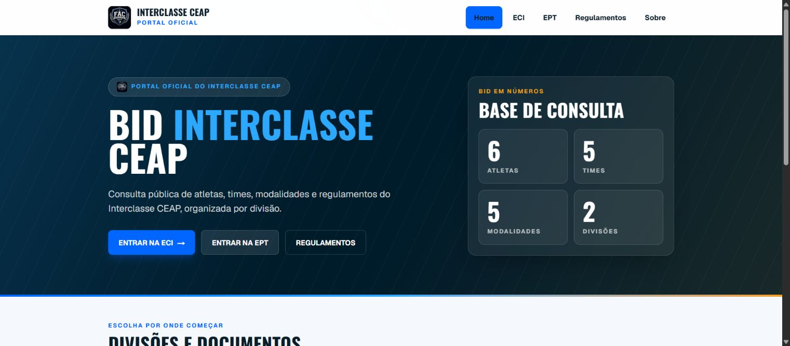
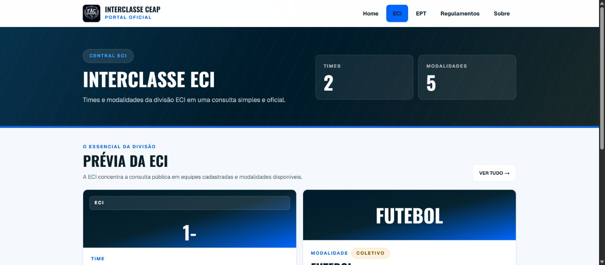
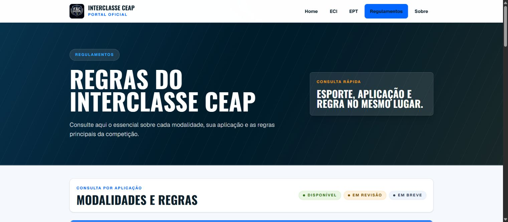
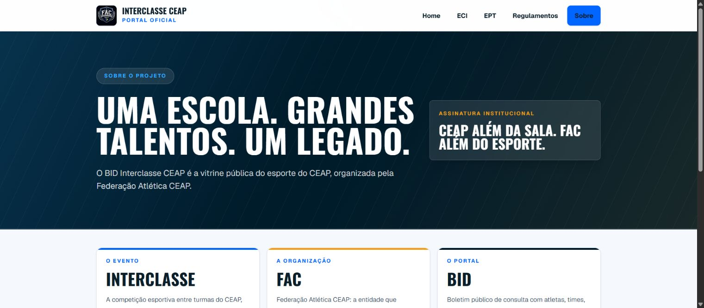

# BID Interclasse CEAP

BID Interclasse CEAP is a public portal created to organize and present information about the CEAP Interclasse and FAC, including athletes, teams, sports, regulations, and institutional content.

The project was designed to centralize scattered information in a cleaner, more accessible, and more structured digital experience for students, teams, organizers, and the school community.

## Live Demo

https://bid-interclasse.vercel.app

## Capturas de tela

| Home | Divisão ECI |
| --- | --- |
|  |  |

| Regulamentos | Sobre |
| --- | --- |
|  |  |

## Overview

| Área | Description |
| --- | --- |
| Problem | Interclasse information can become scattered across messages, spreadsheets, posters, and informal communication. |
| Solution | A public portal that organizes athletes, teams, sports, rules, institutional content, and event information. |
| Users | Students, teams, organizers, school community, and FAC members. |
| Focus | Information architecture, public interface, structured data, and real community use. |

## Project Goal

The goal of this portal is to make the Interclasse experience easier to navigate and understand through a responsive public interface.

It is also an important portfolio project because it shows how technology can support community, organization, culture, and communication in a real context.

## Main Features

- Public institutional pages for Interclasse and FAC context.
- Structured presentation of athletes, teams, sports and rules.
- Local JSON data model prepared for future evolution.
- Responsive interface built with Next.js and Tailwind CSS.
- Metadata, sitemap and deployment structure prepared for production.

## Tech Stack

- Next.js
- TypeScript
- Tailwind CSS
- local JSON data
- Vercel

## Current Scope

- public frontend only
- local JSON-based data
- no backend yet
- no database yet
- no authentication yet
- metadata and deployment structure prepared for production publishing

## Repository Structure

```text
src/
  app/
  components/
  data/
  lib/
  types/
docs/
```

## Running Locally

Install dependencies:

```bash
npm install
```

Run the development server:

```bash
npm run dev
```

On Windows PowerShell, if `npm` is blocked by the local policy, use:

```bash
npm.cmd run dev
```

Validate the project:

```bash
npm.cmd run lint
npm.cmd run build
```

On Linux/macOS:

```bash
npm run lint
npm run build
```

## Why This Project Matters

BID Interclasse CEAP is relevant in my portfolio because it represents a public-facing product with structure, information design, organization, and execution.

It reinforces my interest in building systems that combine technology, communication, and real-world context.

## Next Steps

- Connect official links and final institutional content.
- Expand data coverage as the competition structure evolves.
- Add backend/database if the project needs authenticated management.
- Keep FAC institutional content separated from BID sports data.

## Documentation

- `AGENTS.md`
- `docs/current-state.md`
- `docs/architecture.md`
- `docs/codex-workflow.md`
- `docs/roadmap.md`
- `docs/design-system.md`
- `docs/data-model.md`
